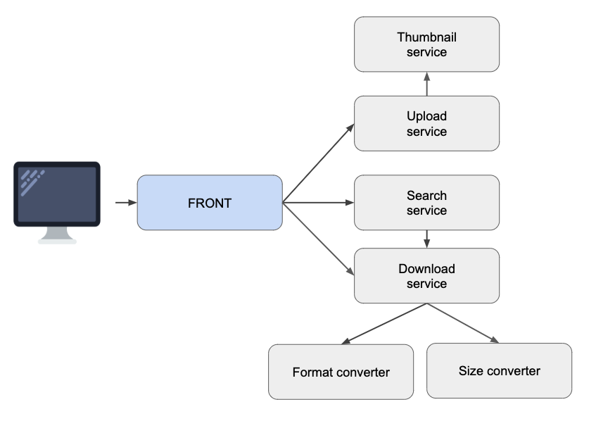

# ADR-0002 - Use a microservices architecture

## Date

2018-12-27

## Status

Accepted

## Context

The web application we want to develop and offer to our users is a picture service that allows :

* Uploading images and gifs with a title and tags
* Searching images by title or tag
* Downloading an image in various file formats and sizes

As we want to quicly build a first version to be able to quickly go online and answer competitors, we choose 
to deploy our application to Google Cloud (as we do not have any bare metal servers).

The application should meet the following criteria:

* it should be quick enough so the search answers in less than 500ms
* it should be scalable so we can meet future usage

## Decision

In order to meet required criteria we choose to develop our application using a microservices approach : 
each business need will be addressed by a specific microservice, as described in the following schema:

Each microservice should take a simple input and produce a simple output, each microservice should act as a black box 
regarding other microservices, meaning state should not be shared across different instances of same or differents microservices.

## Consequences

* Scalability can be made by simply deploying more instances of the same microservice
* Some kind of discovery and load balancing has to be used so each microservice can contact any instance of another 
microservice it needs to work with
* Each microservice should be stateless
* We will have to handle additional complexity linked to microservices architecture : discovery, monitoring, failures, versioning, etc.