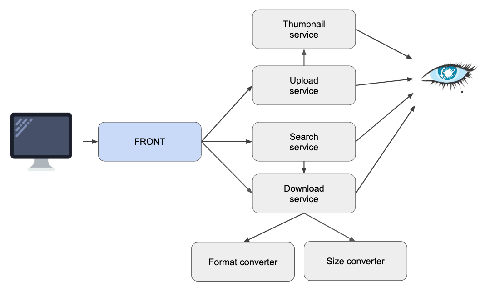

# ADR-0003 - Use Cassandra as storage backend

## Date

2018-12-27

## Status

Accepted (Superseded by [ADR-0005](../0005-use-gcs-as-storage-backend/0005-use-gcs-as-storage-backend.md))

## Context

As the application offers uploads capabilities to our users, we need to be able to store uploaded images to some 
kind of storage. The storage backend should be able to do the following things:

* Store raw images/gifs
* Store thumbnails of images/gifs
* Offer a basic search capability (search by title, search by tag)

## Decision

After a quick comparative study, we decide to go with a Cassandra storage backend. The reasons are the following:

* Cassandra is quick and easy to setup
* It should answer our needs without much custom configuration, even when scaling up
* Cassandra allows us to do simple search operations on the fields we're interested in
* The team is already familiar with Cassandra usage

Here is a quick picture of our architecture including Cassandra as the storage backend:

**Note**: Many services seem to point to the same Cassandra, however we need to setup multiple tables so we can respect 
CQRS principles (command and query separation): 

* One table will be used to store thumbnails
* One table will be used to store raw images
* Thumbnail and upload services are write services (but to different tables)
* Search service and download service are read-only services

### Other databases

In our quest to the holy storage backend we also studied MongoDb but it didn't seem to be a good fit for our use case : its Json-like structure does not fill particularly well with what we are trying to achieve, and is not much appropriate for very large storage volumes.

## Consequences

* We need to install and operate a Cassandra, with replica
* We need to setup 2 separate tables
* We need to setup Cassandra indexes on searchable fields (title, tags)