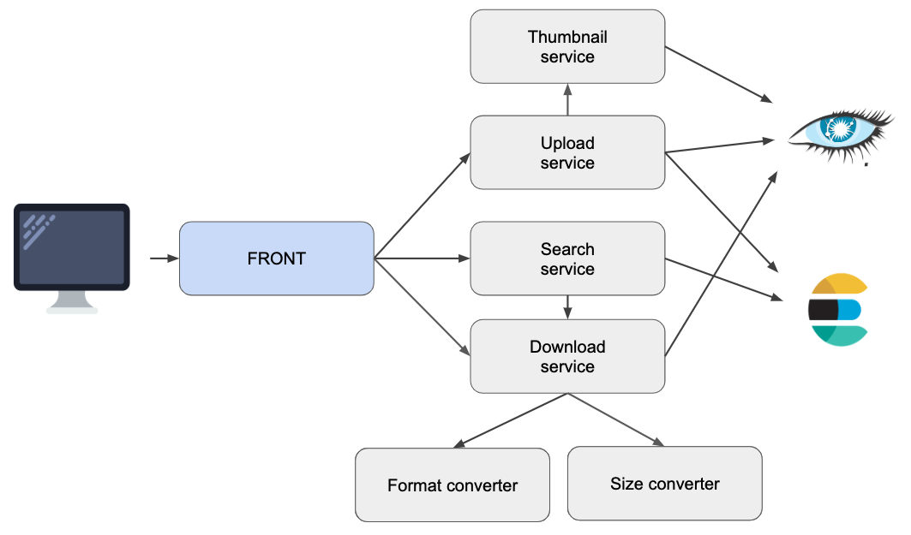

# ADR-0004 - Use Elastic Search for image search

## Date

2018-12-27

## Status

Accepted

## Context

As our users base is growing and we have more and more search queries, we would like to improve current search form to:

* Be able to search on newly added fields (e.g. created date, modified date, author, licence, etc)
* Allow more complex searches on existing and new fields such as:
  * "and" queries to search on multiple tags
  * "or" queries to search on an exclusive list of tags
  * "startsWith" and "contains" search instead of current exact match searches
  * synonyms

## Decision

Given our needs it seems pretty clear that we need a search engine, as databases search capabilities are limited and would cost more and more as data is growing.

We will use Elastic Search as our search engine as it is the de facto standard and is based on battle-tested search engine
Lucene. Our current microservices will now evolve to this schema:

Note: ES indexes do not need to be updated in real-time when a new image/gif is uploaded, in fact we can easily 
tolerate a few minutes of delay between an upload and its actual availability for search. All we need is to be 
eventually consistent.

## Consequences

* Elastic Search must be installed and operated (with replicas and the whole configuration...)
* Elastic Search index will have to be defined carefully to achieve search as we want it (tokenization, synonyms, etc)