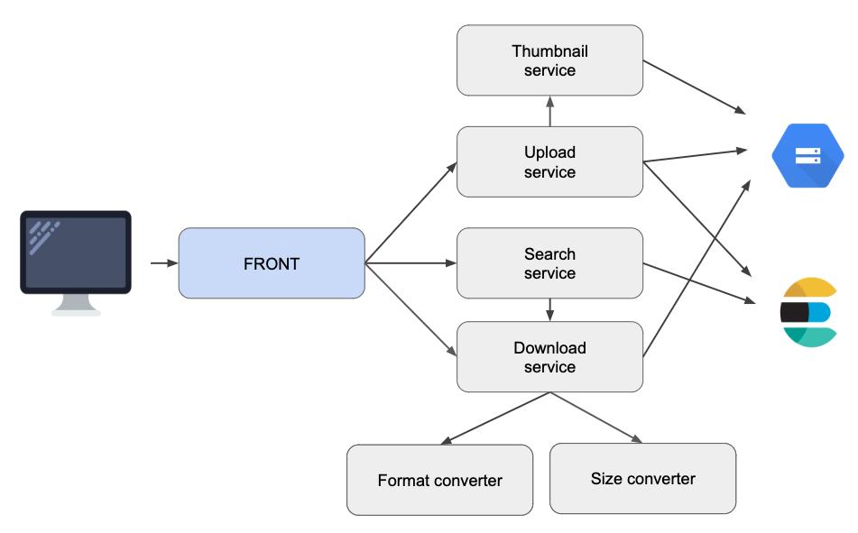

# ADR-0005 - Use Google Cloud Storage (GCS) as storage backend

## Date

2018-12-27

## Status

Accepted (Supersedes [ADR-0003](../0003-use-cassandra-as-storage-backend/0003-use-cassandra-as-storage-backend.md))

## Context

If Cassandra works pretty well as our storage backends, it has multiple drawbacks, the main ones being :

1. We are currently operating Cassandra manually on GCP compute instances which has costs in term of compute instances 
but also human costs as we have to take quite a lot of time to operate Cassandra (for custom configuration, 
adding/removing nodes, upgrading Cassandra, etc.)
1. Cassandra offers an overall scalability (we can add nodes if needed) however this is not a real-time scalability 
which we now might need as our queries rate is growing
1. Scaling down/up takes quite a lot of time and we currently do not have a great availability time

Also, it is important to note that since we [use ES for image search (see ADR 0004)](../0004-use-elastic-search-for-image-search/0004-use-elastic-search-for-image-search.md) 
we kind of lost the interest of using a database as we don't do queries per-say, we now only use the database as a 
storage capability where we only download images from... Cassandra might be a bit overkill for this need ! 

## Decision

As we are currently deploying all our microservices on a Kubernetes cluster on GCP we could really benefit from 
using Google Cloud Storage (GCS) to simply store all of images as raw files on GCP buckets. The new architecture will be as described below:

A few notes:

* GCS storage costs will be lower than our actual Cassandra storage + compute instances costs
* We will only store all the images as raw data on GCS buckets
* We will need some kind of logical ordering for buckets : e.g. paths that look like `/somename/year/month/day`

Switching from Cassandra to GCS means that we have to operate a migration of all the data. This also means that we
 should handle a mixed mode for a while. The steps of the migration are as follow:

1. Add GCS interface for upload service so we can upload to GCS
1. Make sure the indexed documents reflects the URL as a GCS storage URL and not a Cassandra id anymore
1. Add support in download service to be able to download either from Cassandra or from GCS depending on the URL
1. Write a migration script that takes all the data in Cassandra and push it in appropriate GCS buckets
1. Remove support for download from Cassandra

Following all these steps in order should guarantee a 0 downtime of our services.

### Why not a managed Bitnami-Cassandra on GCP ?

Even if a managed Cassandra on GCP could greatly lower our current operational costs on Cassandra, we couldn't use it at the 
 time of the decision because it simply wasn't existing !
 
We could consider it now however it seems that our needs now that search is externalized into ES are much simpler than that
 and thus Cassandra would still be overkill for our needs, and would still cost us more than a simple GCS storage.

## Consequences

* We do not manage the storage backend ourselves
* We can easily switch from regional to multi-regional storage class in the future to meet internationalization needs
* Scalability is automatically handled by GCS itself and is pretty reliable
* GCS SLA is of 99.9 on regional storage, which should be more than enough for our needs
* Metadata of images (including the image full path on the bucket) must always be indexed into ES otherwise image
 is not searchable
* We should consider doing the migration